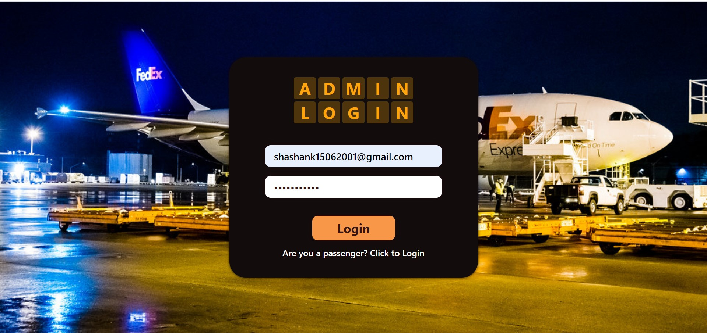
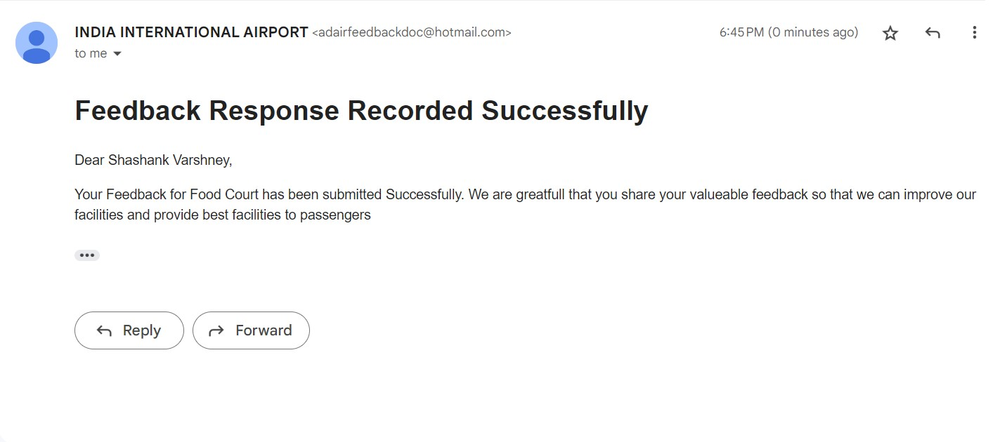

# About Project
## Airport Feedback App collects feedback forms of customer's satisfaction/grievance of different aspects of airport. Project is to collect the data electronically in the form of an app with selectable parameters and rating. The app will be available by default on the free Wi-Fi service that IIA is going to provide at the airport.

# Deployment Link
## https://airport-feedback-shashank152001.vercel.app/

# Documentation
<a href="documents/Form 1.pdf">Form 1</a>

# Project ScreenShots

## About Page

## Admin Login

## Admin Dashboard

## Feedback (comman for Passenger and Admin)

## FoodResult Feedback

 
 
 ## Passenger Login
 
 
 ## Passenger Dashboard
  
 
  ## Passenger Giving Feedback For FoodCout
  
  
  
  ## Passenger submit feedback successfully
  

  ## Passenger receiveing mail after feedback submission successfully
  

# Database ScreenShots

# Credentials for admin
## Username : shashank15062001@gmail.com
## Password : Shashank123

# Credentials for passenger
## Name : Your Name
## Email : Your Email
## Mobile Number : Your Mobile Number
## PNR : 12345467890 

# Run App on Local Machine
## Install Node on Your System
## do npm install in frontend and backend folder
## create .env file in backend folder and add DB_CLUSTER: your cluster name, DB_USERNAME: your DB username, DB_PASSWORD: your db password, PRIVATE_KEY:your private key, EMAIL_ID: your email id, EMAIL_PASSWORD: your email password 
## Note- can't share mine .env due to some security and privacy issues
## cd into backend and do "npm run runServer"
## cd into frontend and do "npm run start"

# Contributors
## Member-1
## Name : Shashank Varshney
## Roll No: 19ESKIT086
## Branch: IT-B (G2)
## Role: Full Stack Developer (Frontend- ReactJs/Backend- Node, Express and MongoDB)

## Member-2
## Name : Shivam Thakkar
## Roll No: 19ESKIT087
## Branch: IT-B (G2)
## Role: Frontend Developer (ReactjS)

## Member-3
## Name : Sujal Somani
## Roll No: 19ESKIT092
## Branch: IT-B (G2)
## Role: Frontend Developer (ReactjS)

## Member-4
## Name : Yuvraj Grakkhar
## Roll No: 19ESKIT100
## Branch: IT-B (G2)
## Role: Backend Developer (Node, express and MongoDB)

